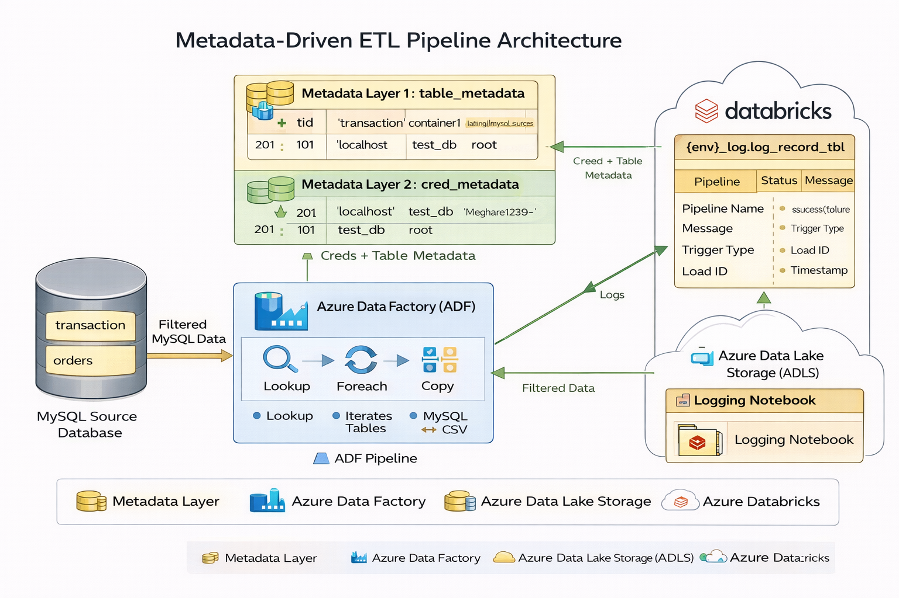

# 🚀 ADF + Databricks Metadata-Driven ETL Pipeline (MySQL → ADLS → Databricks)

## 📌 Overview
This project demonstrates a **metadata-driven ETL pipeline** built using **Azure Data Factory (ADF)** and **Azure Databricks**. The pipeline dynamically ingests data from **MySQL**, lands it into **Azure Data Lake Storage (ADLS)**, and logs execution details using Databricks.

The solution is designed to be scalable, reusable, and dynamic using metadata tables.

---

## 🏗️ Architecture
- **Source**: MySQL Database  
- **Orchestration**: Azure Data Factory  
- **Storage**: Azure Data Lake Storage (ADLS Gen2)  
- **Processing & Logging**: Azure Databricks  

---

## Architecture Diagram

---

## 🚀 Key Features
- Metadata-driven ingestion pipeline  
- Dynamic handling of multiple tables  
- Parameterized linked services and datasets  
- Automated pipeline execution using Lookup + ForEach  
- Logging framework using Databricks  
- Scalable and reusable design  

---

## 🛠️ Tech Stack
- Azure Data Factory (ADF)  
- Azure Databricks  
- Azure Data Lake Storage (ADLS Gen2)  
- MySQL  
- PySpark  

---

## 📂 Project Flow

### 1️⃣ Source System (MySQL)
- Tables:
  - `transaction`
  - `orders`

---

### 2️⃣ Metadata Layer (Databricks)
- **table_metadata**
  - Stores table-level details (path, filename, container)

- **cred_metadata**
  - Stores connection details (server, DB, credentials)

- **View:**
vw_cred_table_join

## 3️⃣ Azure Data Factory Pipeline

### 🔹 Activities Used

**1. Lookup Activity**
- Reads metadata from Databricks view  
- Returns list of tables and connection details  

**2. ForEach Activity**
- Iterates over each table dynamically  

**3. Copy Activity**
- Source: MySQL (dynamic connection)  
- Sink: ADLS (CSV format)  

**4. Notebook Activity**
- Executes Databricks notebook for logging  

---

## 4️⃣ Data Storage (ADLS)

- Data is stored in:
  container1/landing/mysql_source/
- File format: CSV  

---

## 5️⃣ Logging Framework (Databricks)

### Log Table:
{env}_log.log_record_tbl

### Captures:
- Pipeline Name  
- Status (Success/Failure)  
- Message  
- Trigger Type  
- Load ID  
- Timestamp  

---

## ⚙️ Linked Services

- ADF → Databricks  
- Databricks (Lookup)  
- MySQL (Custom IR)  
- ADLS (Sink)  

---

## 📊 Datasets

- Lookup Dataset → Reads metadata  
- Source Dataset → MySQL tables  
- Sink Dataset → ADLS storage  

---

## ▶️ How It Works

1. Metadata is stored in Databricks tables  
2. ADF Lookup reads metadata dynamically  
3. ForEach loops through each table  
4. Copy Activity extracts data from MySQL  
5. Data is stored in ADLS  
6. Databricks notebook logs execution details  

---

## ❗ Key Design Concepts

- Metadata-driven architecture → No hardcoding  
- Dynamic pipelines → Easily scalable  
- Separation of concerns → Source, processing, storage  
- Reusable components → Linked services & datasets  

---

## 📈 Future Enhancements

- Incremental data loading  
- Integration with Delta Lake (Bronze/Silver/Gold)  
- Data quality checks  
- Monitoring & alerting  
- CI/CD pipeline integration  

---

## ⚠️ Best Practices Followed

- Parameterized datasets and linked services  
- Consistent naming conventions  
- Secure handling of credentials  
- Logging and monitoring  
